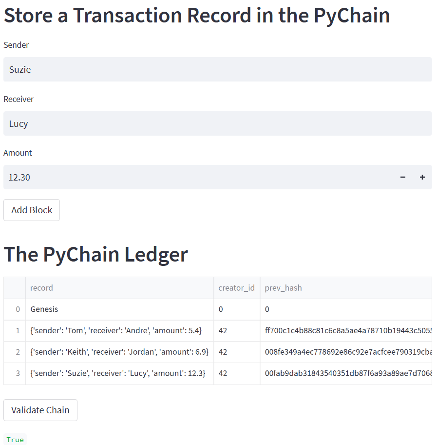
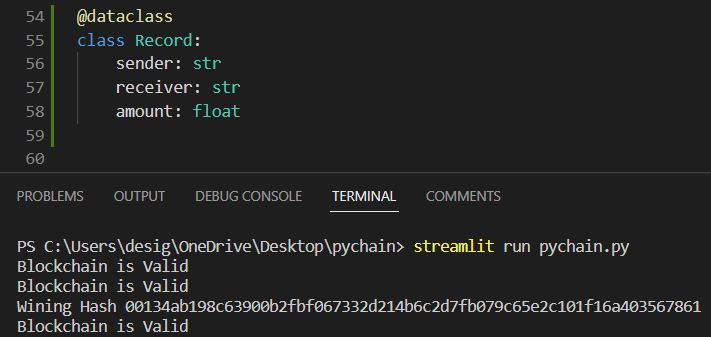
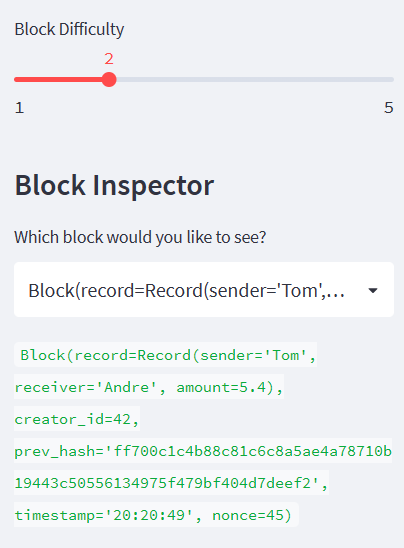

# Module 18: pychain

# Overview

For this task, we have looked to build a blockchain-based ledger system along with a user-friendly web interface using the streamlit library in python. The interface allows users to input and view transaction between customers. That is, it allows users to view the transfer of money from sender to receiver as well as the amount. In addition users will also be able to view the ledger and chain of transactions and also verify the integrity of the data in the ledger.

 

# Streamlit Pychain Ledger
The below screensot shows a ficticious exampe of transactions along with the Pychain Ledger. The ledger also contains the timestamp and nonce (which is not contained in the below screenshot), but are additional features used to verify the transaction. 

    

 

In addition we also show a screenshot from our vs-code terminal showing the winning hash and verifying that the blockchain is valid.

    

 

Lastly we show a screenshot of the block data. That is the inputs that are used to construct a block in the Pychain ledger. The other input is the record which the user inputs.

    

